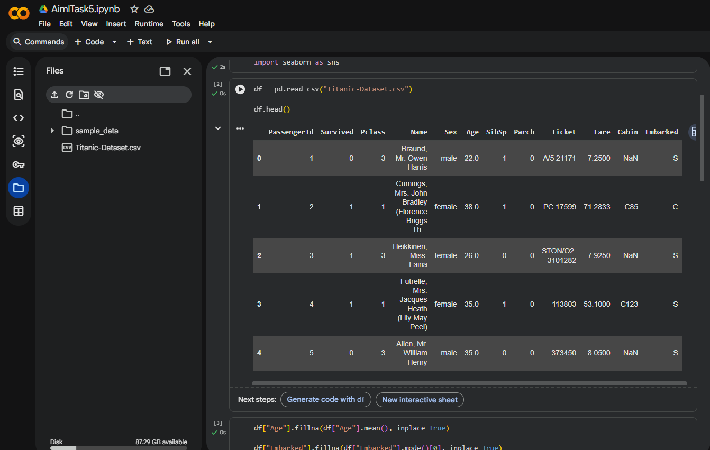
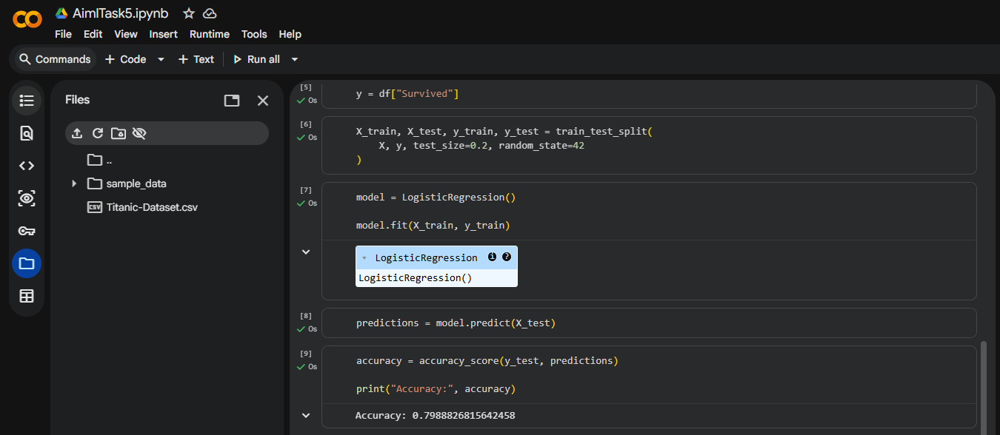
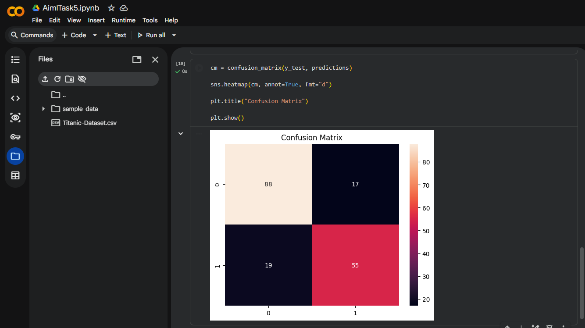
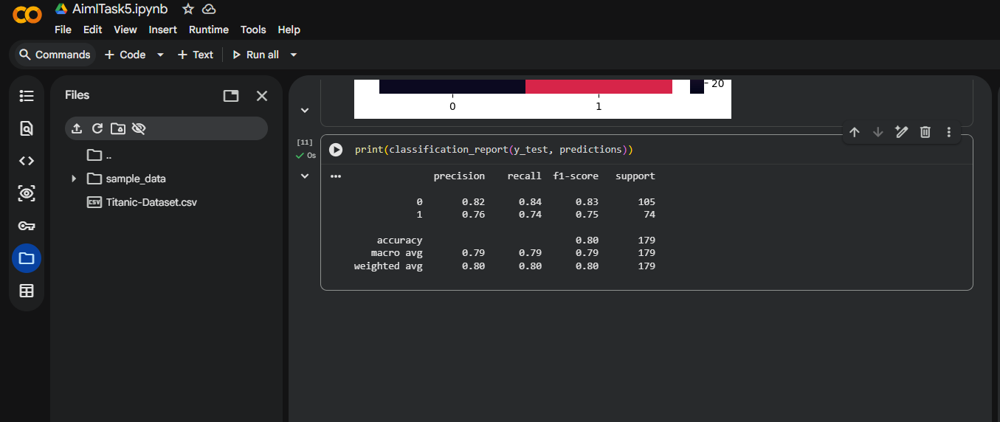

# Implementing a Basic Machine Learning Model Using Python

## Objective
The objective of this project is to implement a basic machine learning model using Python and understand the complete machine learning workflow.

## Dataset Used
Titanic Dataset

## Algorithm Used
Logistic Regression

## Tasks Performed
- Data loading
- Data cleaning
- Feature selection
- Data preprocessing
- Train-test splitting
- Model training
- Prediction
- Model evaluation

## Libraries Used
- Pandas
- NumPy
- Scikit-learn
- Matplotlib
- Seaborn

## Evaluation Metrics
- Accuracy Score
- Confusion Matrix
- Classification Report

## Screenshots

### Dataset Loading

### Model Training & Accuracy

### Confusion Matrix

### Classification Report

## Outcome
This project helped understand the end-to-end machine learning workflow including training, testing, prediction, and evaluation using Logistic Regression.
